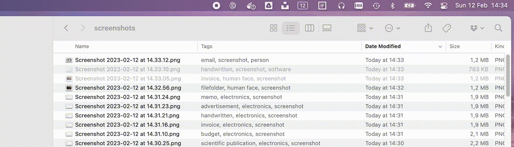

# AI Tagger


AI Tagger is a macOS utility that can automatically tag images based on AI detected content.



## Get started

### Setup source code and resources

- Ensure to pull in the git submodule: `git submodule update --init --recursive`.
- In Azure create a 'Computer vision' resource and update the endpoints and credentials in AITagger/AppDelegate.cs.

### Setup Azure Machine Learning endpoint - local

Note: the docker image needs enough resources to work with. Without enough CPU/RAM the internal process fails with a sigkill and you would get an internal server error back from the scoring endpoint. For my local tests I gave my docker engine 24GB memory and 10 CPU cores.

```bash
$ cd ml-endpoint

# build the docker image which contains our model execution
$ docker build -f ./base/minimal-single-model-conda-in-dockerfile.dockerfile -t azure-ai-experiments/azure-donut-base-finetuned-rvlcdip:1 ./asset

# create/deploy a local endpoint linked to your docker image
$ az ml online-deployment create --local --endpoint-name donut-rvlcdip -f ./base/minimal-single-model-conda-in-dockerfile-deployment.yml

# get endpoint info to find out on what url/port it is running
$ az ml online-endpoint show -n donut-rvlcdip --local

# validate endpoint - ensure to use endpoint from previous call
$ curl http://localhost:55001/score -F "image=@test.png" -v
```

### Setup Azure Machine Learning endpoint - cloud

Create following Azure resources: an Azure Machine Learning workspace and a container registry.

```bash
$ cd ml-endpoint

# build the docker image which contains our model execution (same as local)
$ docker build -f ./base/minimal-single-model-conda-in-dockerfile.dockerfile -t azure-ai-experiments/azure-donut-base-finetuned-rvlcdip:1 ./asset

# ensure to login to your docker registery
$ az acr login --name $REGISTRY

# push the docker image to the registry
$ docker tag azure-ai-experiments/azure-donut-base-finetuned-rvlcdip:1 $REGISTRY/azure-ai-experiments/azure-donut-base-finetuned-rvlcdip:1
$ docker push $REGISTRY/azure-ai-experiments/azure-donut-base-finetuned-rvlcdip:1

# create an online endpoint
$ az ml online-endpoint create -f ./base/minimal-single-model-endpoint.yml

# deploy the online endpoint
$ az ml online-deployment create --endpoint-name donut-rvlcdip -f ./base/minimal-single-model-conda-in-dockerfile-deployment.yml --all-traffic

# get endpoint info to find out on what url/port it is running
$ az ml online-endpoint show -n donut-rvlcdip --local

# get the credentials neccessary to communicate with the endpoint
$ KEY=$(az ml online-endpoint get-credentials -n donut-rvlcdip --query primaryKey -o tsv)

# get endpoint info to find out on what url/port it is running
$ az ml online-endpoint show -n donut-rvlcdip

# validate endpoint - ensure to use endpoint from previous call
$ curl https://$ENDPOINT/score  -H "Authorization: Bearer $KEY" -F "image=@test.png" -v
```

## Release notes

v1.0 (Feb 12, 2023)

- mac utility which listens to file changes
- no UI for settings - to be managed in code
- on new files: attempt to gain info about the image through AI
- AI Cognitive Services integration (vision client)
- AI Machine Learning integration (online endpoint with donut model)

## Attributions

- Icons made by [Freepik - Flaticon](https://www.flaticon.com/authors/freepik).
- [Donut source code](https://github.com/clovaai/donut) 
- [Hugging Face model](https://huggingface.co/naver-clova-ix/donut-base-finetuned-rvlcdip)
