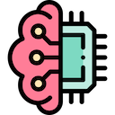

# AI Tagger

AI Tagger is a macOS utility that can automatically tag images based on AI detected content.

## Release notes

v1.0
- mac utility which listens to file changes
- no UI for settings - to be managed in code
- on new files: attempt to gain info about the image through AI
- AI Cognitive Services integration (vision client)
- AI Machine Learning integration (online endpoint with donut model)

## Attributions

- Icons made by [Freepik - Flaticon](https://www.flaticon.com/authors/freepik).
- [Donut source code](https://github.com/clovaai/donut) 
- [Hugging Face model](https://huggingface.co/naver-clova-ix/donut-base-finetuned-rvlcdip)
